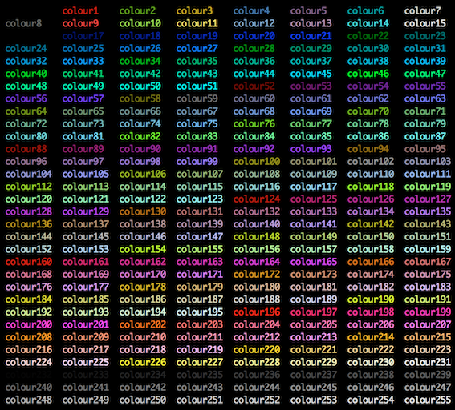

tmux conf
=========

An intuitive and elegant tmux conf profile that you can put inside you home directory: "~/.tmux.conf".
For more information please check the Ubuntu online man page [here](http://manpages.ubuntu.com/manpages/precise/en/man1/tmux.1.html).

What the config brings:
-----------------------
By using key binding with the keyword "bind-key" you can have a very useful shortcuts:
- Create a new window with: **Ctrl+t** [t for terminal].
- Split the windows horizontally by pressing: **Ctrl+h**.
- Split the windows vertically by pressing: **Ctrl+v**.
- Next layout with **Ctrl+space**.
- A very sexy feature: move between windows by just pressing **page up** and **page down**.
- Kill a window by pressing: **Ctrl+k**.
- Detach the session by pressing: **Ctrl+x**.
- Use the mouse to scroll the active window and copy text, by pressing **alt** and the **left button**.
- The vi copy mode is disable, to use it just uncomment the line where it is indicated.

**N.B**: I used keys for the binding that are not in conflict with the bash shortcuts, that's why for example I use *Ctrl+t* for new window and not *Ctrl+w* because the later is used in bash to remove the last word from the cursor position backward.

If you want to customize the colors here is a table of tmux colors which are the same as the bash colors (so your can use it for you PS1 customization):

